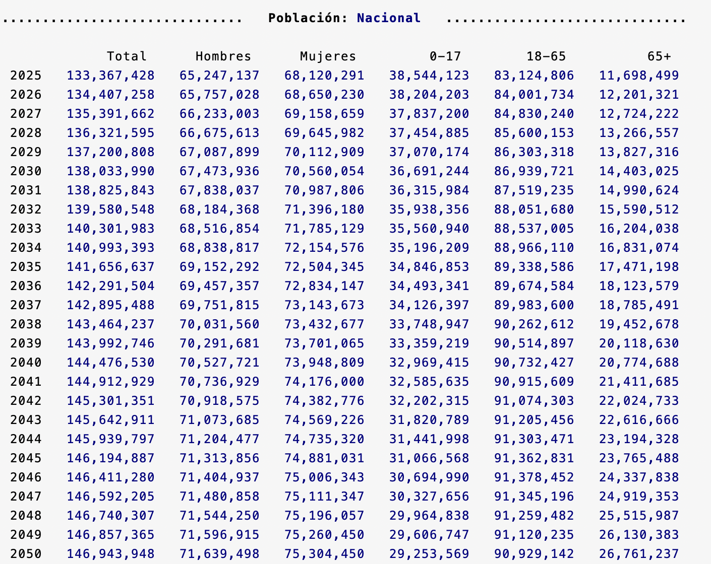
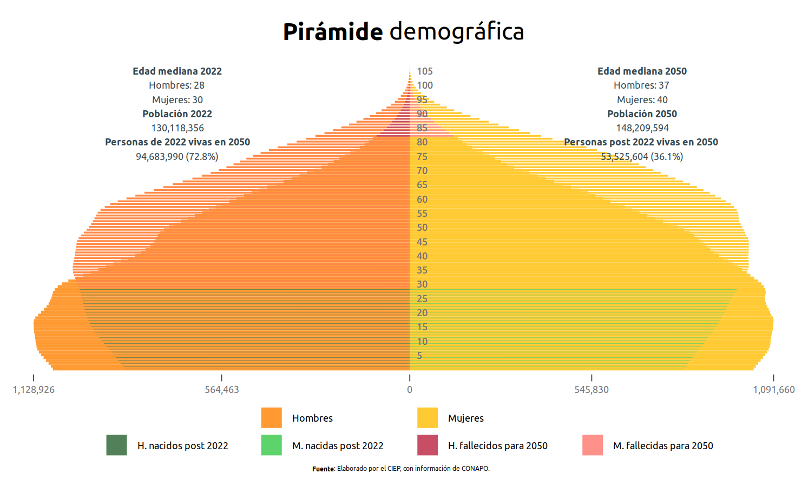

# Simulador Fiscal CIEP v5.3: Población y proyecciones

Versión: 19 de febrero de 2025

---

## Poblacion.ado

**Descripción:** *Ado-file* que automatiza la extracción de datos de las Proyecciones de la Población de México del CONAPO. 

### 1. Input: 
En este programa se integran 3 bases de datos de CONAPO:[^1]

1. Población: Contiene la estimación del número de habitantes a mitad de cada año entre 1950 y 2070.
2. Defunciones: Contiene la estimación de las defunciones anuales entre 1950 y 2070. 
3. Migración Internacional: Contiene la estimación del número de inmigrantes y emigrantes internacionales entre 1950 y 2069.

### 2. Sintaxis:

Para extraer datos, ingresa el prompt en la consola llamando al programa y selecciona los filtros y opciones deseados. 

El prompt sigue esta sintaxis:
`Poblacion [if] [, ANIOinicial(int) ANIOFINAL(int) NOGraphs UPDATE]`

**A. Filtros disponibles:**

<!-- Filtros disponibles para incluir en el comando -->

<!-- Filtro: Entidad -->
<label for="estado">Entidad:</strong></label>
<select id="estado" onchange="actualizarComando()">
  <option value="" selected disabled>Selecciona un estado</option>
  <option value="Nacional">Nacional</option>
  <option value="Aguascalientes">Aguascalientes</option>
  <option value="Baja California">Baja California</option>
  <option value="Baja California Sur">Baja California Sur</option>
  <option value="Campeche">Campeche</option>
  <option value="Chiapas">Chiapas</option>
  <option value="Chihuahua">Chihuahua</option>
  <option value="Ciudad de México">Ciudad de México</option>
  <option value="Coahuila">Coahuila</option>
  <option value="Colima">Colima</option>
  <option value="Durango">Durango</option>
  <option value="Estado de México">Estado de México</option>
  <option value="Guanajuato">Guanajuato</option>
  <option value="Guerrero">Guerrero</option>
  <option value="Hidalgo">Hidalgo</option>
  <option value="Jalisco">Jalisco</option>
  <option value="Michoacán">Michoacán</option>
  <option value="Morelos">Morelos</option>
  <option value="Nayarit">Nayarit</option>
  <option value="Nuevo León">Nuevo León</option>
  <option value="Oaxaca">Oaxaca</option>
  <option value="Puebla">Puebla</option>
  <option value="Querétaro">Querétaro</option>
  <option value="Quintana Roo">Quintana Roo</option>
  <option value="San Luis Potosí">San Luis Potosí</option>
  <option value="Sinaloa">Sinaloa</option>
  <option value="Sonora">Sonora</option>
  <option value="Tabasco">Tabasco</option>
  <option value="Tamaulipas">Tamaulipas</option>
  <option value="Tlaxcala">Tlaxcala</option>
  <option value="Veracruz">Veracruz</option>
  <option value="Yucatán">Yucatán</option>
  <option value="Zacatecas">Zacatecas</option>
</select>

<!-- Filtro: Sexo -->
<label for="sexo">Sexo:</strong></label>
<select id="sexo" onchange="actualizarComando()">
  <option value="" selected disabled>Selecciona el sexo</option>
  <!-- Se asigna "1" para Hombres y "2" para Mujeres -->
  <option value="1">Hombres</option>
  <option value="2">Mujeres</option>
</select>

**B. Opciones disponibles:**

<!-- Filtro: Año inicial y final -->
<label for="anioInicial">Año Inicial:</strong></label>
<input type="number" id="anioInicial" placeholder="Escribe el año base" oninput="actualizarComando()">

<label for="anioFinal">Año Final:</strong></label>
<input type="number" id="anioFinal" placeholder="Escribe el año final" oninput="actualizarComando()">

<!-- Opciones: NOGraphs y UPDATE -->
<label for="noGraphs">Sin gráficos:</label>
<input type="checkbox" id="noGraphs" onchange="actualizarComando()">

<label for="update">Actualizar base:</label>
<input type="checkbox" id="update" onchange="actualizarComando()">

**Copia y pega este comando en la consola:**
<pre id="codigoComando">Poblacion</pre>

  
Mostrar código

  

### 3. Output:

Tras ingresar el prompt, el código regresará tres elementos: ventana de resultados, dos gráficas y la base de datos. Podrás modificar el ado.file para obtener una base a tus necesidades.

**1. Ventana de Resultados:** Muestra un resumen del análisis realizado. 

   

**2. Gráficas:** Representación visual de los indicadores calculados.

 

 

**3. Base de Datos:** Permite al usuario obtener una base recortada y limpia para hacer sus propios análisis.

### Revisar
1. **Gráfica de la pirámide demográfica** por edades y para el año inicial y final.
2. **Gráfica de la transición demográfica** por grupo de edades y años.

[^1]: **Link:** [Bases de Datos CONAPO](https://www.gob.mx/conapo/articulos/reconstruccion-y-proyecciones-de-la-poblacion-de-los-municipios-de-mexico)
